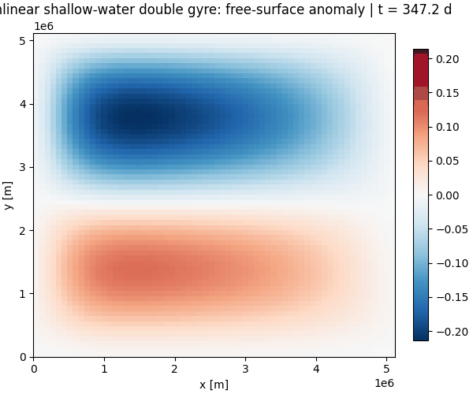
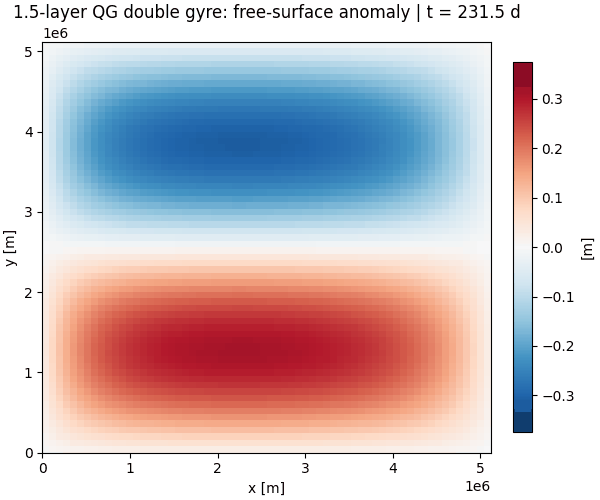

<p align="center">
  <h1 align="center">finitevolX</h1>
  <p align="center">
    <em>Finite-volume operators for JAX on Arakawa C-grids</em>
  </p>
</p>

<p align="center">
  <a href="https://github.com/jejjohnson/finitevolX/actions/workflows/ci.yml"></a>
  <a href="https://github.com/jejjohnson/finitevolX/actions/workflows/lint.yml"></a>
  <a href="https://github.com/jejjohnson/finitevolX/actions/workflows/typecheck.yml"></a>
  <a href="https://www.codefactor.io/repository/github/jejjohnson/finitevolx"></a>
  <a href="https://codecov.io/gh/jejjohnson/finitevolX"></a>
  <a href="https://www.python.org/"></a>
  <a href="https://opensource.org/licenses/MIT"></a>
</p>

<p align="center">
  <a href="https://jejjohnson.github.io/finitevolX/"><strong>Documentation</strong></a> &bull;
  <a href="#installation"><strong>Installation</strong></a> &bull;
  <a href="#quick-start"><strong>Quick Start</strong></a> &bull;
  <a href="#examples"><strong>Examples</strong></a>
</p>

---

**finitevolX** provides staggered finite-volume building blocks for ocean and atmosphere modelling in [JAX](https://github.com/jax-ml/jax).  Every operator is a pure function or stateless [equinox](https://docs.kidger.site/equinox/) Module — fully compatible with `jax.jit`, `jax.vmap`, and `jax.grad`.

```python
import finitevolx as fvx

# Build an Arakawa C-grid (64x64 interior + 2-cell ghost ring)
grid = fvx.ArakawaCGrid2D.from_interior(64, 64, Lx=5.12e6, Ly=5.12e6)

# Operators are stateless modules
diff  = fvx.Difference2D(grid)
div   = fvx.Divergence2D(grid)
vort  = fvx.Vorticity2D(grid)

# Compute divergence at T-points from staggered velocities
div_uv = div(u, v)

# Solve the Helmholtz equation (∇² − λ)ψ = q  for streamfunction
psi = fvx.solve_helmholtz_dst(q, grid.dx, grid.dy, lambda_=1/Ld**2)

# Time-step with Heun's method (RK2)
state_next = fvx.heun_step(tendency_fn, state, dt)
```

---

## Features

### Grids & Masks

| Component | Description |
|-----------|-------------|
| `ArakawaCGrid1D/2D/3D` | Staggered C-grid containers with T, U, V, X point locations |
| `Mask2D` | Land/ocean masks with automatic staggered derivation (h, u, v, psi) |
| Boundary classification | 4-level land/coast/near-coast/ocean + vorticity boundary categories |
| Stencil capability | Adaptive WENO stencil dispatch at irregular coastlines |
| `SphericalArakawaCGrid2D/3D` | Spherical coordinate grids |

### Operators

| Operator | Class | Description |
|----------|-------|-------------|
| Difference | `Difference1D/2D/3D` | Forward/backward differences, Laplacian, curl, gradient |
| Interpolation | `Interpolation1D/2D/3D` | Staggered averaging (T↔U, T↔V, X↔T, etc.) |
| Divergence | `Divergence2D/3D` | Backward-difference divergence at T-points |
| Vorticity | `Vorticity2D/3D` | Relative vorticity, potential vorticity, PV flux |
| Coriolis | `Coriolis2D/3D` | Beta-plane Coriolis tendencies |
| Diffusion | `Diffusion2D/3D` | Harmonic and biharmonic diffusion |
| Advection | `Advection1D/2D/3D` | Flux-form with upwind, TVD (minmod/van Leer/superbee/MC), WENO3/5/7/9 |
| Jacobian | `arakawa_jacobian` | Energy-conserving Arakawa Jacobian |
| Diagnostics | `kinetic_energy`, `enstrophy`, `okubo_weiss`, ... | Scalar diagnostics |
| Spherical | `SphericalDivergence2D`, `SphericalLaplacian2D`, ... | Operators on the sphere |

### Boundary Conditions

Per-face composable BCs with ghost-cell enforcement:

`Periodic` &bull; `Dirichlet` &bull; `Neumann` &bull; `Robin` &bull; `Slip` &bull; `Sponge` &bull; `Reflective` &bull; `Extrapolation` &bull; `Outflow`

### Elliptic Solvers

| Solver | Use case | Accuracy |
|--------|----------|----------|
| **Spectral** (DST/DCT/FFT) | Rectangular, constant coefficient | Machine precision |
| **Capacitance matrix** | Masked domains, simple coastlines | Machine precision |
| **Preconditioned CG** | Arbitrary masks, tight tolerance | Controllable |
| **Multigrid** | Variable coefficients, any mask | O(N) per V-cycle |
| **MG + CG** | Variable coefficients, tight tolerance | Controllable |

Convenience wrappers: `streamfunction_from_vorticity`, `pressure_from_divergence`, `pv_inversion`

### Time Integration

**Functional steppers** (pure functions, no hidden state):

`euler_step` &bull; `heun_step` &bull; `rk4_step` &bull; `rk3_ssp_step` &bull; `ab2_step` &bull; `ab3_step` &bull; `leapfrog_raf_step` &bull; `imex_ssp2_step` &bull; `split_explicit_step` &bull; `semi_lagrangian_step`

**[diffrax](https://docs.kidger.site/diffrax/) integration**: `ForwardEulerDfx`, `RK2Heun`, `RK3SSP`, `RK4Classic`, `SSP_RK104`, `IMEX_SSP2`, and more — with adaptive stepping, checkpointing, and `SaveAt`.

### Vertical Structure

`multilayer` vmap helper &bull; `decompose_vertical_modes` &bull; `layer_to_mode` / `mode_to_layer` transforms &bull; `build_coupling_matrix`

---

## Installation

### pip

```bash
pip install git+https://github.com/jejjohnson/finitevolX
```

### uv (recommended)

```bash
git clone https://github.com/jejjohnson/finitevolX.git
cd finitevolX
uv sync --all-extras
```

---

## Quick Start

Build a grid, compute vorticity, and invert for the streamfunction:

```python
import jax
import jax.numpy as jnp
import finitevolx as fvx

jax.config.update("jax_enable_x64", True)

# 1. Grid
grid = fvx.ArakawaCGrid2D.from_interior(64, 64, Lx=1e6, Ly=1e6)

# 2. Operators
diff = fvx.Difference2D(grid)
vort = fvx.Vorticity2D(grid)

# 3. Velocity field (full grid with ghost ring)
Ny, Nx = grid.Ny, grid.Nx
j, i = jnp.mgrid[:Ny, :Nx]
u = -jnp.sin(jnp.pi * j / Ny) * jnp.cos(jnp.pi * i / Nx)
v =  jnp.cos(jnp.pi * j / Ny) * jnp.sin(jnp.pi * i / Nx)

# 4. Relative vorticity at X-points (corners)
zeta = vort.relative_vorticity(u, v)

# 5. Invert for streamfunction: ∇²ψ = ζ
psi = fvx.streamfunction_from_vorticity(
    zeta[1:-1, 1:-1], grid.dx, grid.dy
)
```

See the [documentation](https://jejjohnson.github.io/finitevolX/) for the full API reference.

---

## Examples

The `docs/notebooks/` directory contains pedagogical Jupytext notebooks that build models step by step with equations, ASCII diagrams, and inline figures. The `scripts/` directory has production simulation scripts that generate Zarr output and animated GIFs.

### Tutorials

| Notebook | Description | Key APIs |
|----------|-------------|----------|
| [Masks](docs/notebooks/demo_masks.py) | C-grid mask construction, staggered derivation, boundary classification | `Mask2D` |
| [Elliptic Solvers](docs/notebooks/demo_solvers.py) | Spectral, capacitance, CG, multigrid on 4 geometries + inhomogeneous BCs | `solve_helmholtz_dst`, `build_capacitance_solver`, `solve_cg`, `build_multigrid_solver` |
| [Pressure Poisson](docs/notebooks/pressure_poisson.py) | Divergence-free projection on the C-grid, DST-I vs DST-II | `Divergence2D`, `Difference2D`, `solve_poisson_dst` |
| [Streamfunction Inversion](docs/notebooks/streamfunction_inversion.py) | X-point vs T-point placement, velocity recovery, convergence | `streamfunction_from_vorticity`, `solve_poisson_dst2` |
| [Helmholtz Screening](docs/notebooks/helmholtz_screening.py) | QG PV inversion with screening, JIT/vmap/grad | `StaggeredDirichletHelmholtzSolver2D`, `pv_inversion` |

### Time-Dependent Models

| Notebook | Model | Key APIs |
|----------|-------|----------|
| [Linear Shallow Water](docs/notebooks/swm_linear.py) | Wind-driven double gyre on beta-plane | `Difference2D`, `Interpolation2D`, `Vorticity2D`, `heun_step` |
| [Nonlinear Shallow Water](docs/notebooks/shallow_water.py) | Full depth continuity + momentum advection | `Advection2D`, `Difference2D`, `heun_step` |
| [1.5-Layer QG](docs/notebooks/qg_1p5_layer.py) | PV advection + Helmholtz inversion | `Advection2D`, `solve_helmholtz_dst`, `heun_step` |

### Double-Gyre Simulations (production scripts)

Run the full-resolution simulations with spin-up and Zarr/GIF output:

```bash
uv run python scripts/swm_linear.py        # Linear shallow-water
uv run python scripts/shallow_water.py      # Nonlinear shallow-water
uv run python scripts/qg_1p5_layer.py       # 1.5-layer QG
```

| Linear SWM | Nonlinear SWM | 1.5-Layer QG |
|:---:|:---:|:---:|
|  |  |  |

---

## Documentation

Full documentation with theory, usage guides, and API reference:

**[jejjohnson.github.io/finitevolX](https://jejjohnson.github.io/finitevolX/)**

| Section | Content |
|---------|---------|
| [C-Grid Discretization](https://jejjohnson.github.io/finitevolX/cgrid_discretization/) | Theory of Arakawa C-grid staggering |
| [Operators](https://jejjohnson.github.io/finitevolX/spatial_operators/) | Divergence, vorticity, Coriolis, diffusion |
| [Advection](https://jejjohnson.github.io/finitevolX/advection/) | TVD and WENO reconstruction theory |
| [Boundary Conditions](https://jejjohnson.github.io/finitevolX/boundary_conditions/) | Per-face BC composition |
| [Elliptic Solvers](https://jejjohnson.github.io/finitevolX/elliptic_solvers/) | Spectral, capacitance, CG, multigrid theory |
| [Time Integration](https://jejjohnson.github.io/finitevolX/time_integration/) | Explicit, IMEX, and diffrax-based steppers |
| [Solver Comparison](https://jejjohnson.github.io/finitevolX/solver_comparison/) | Visual benchmark across geometries |
| [API Reference](https://jejjohnson.github.io/finitevolX/api/grids/) | Auto-generated from docstrings |

---

## References

**Software**

- [spectraldiffx](https://github.com/jejjohnson/spectraldiffx) &mdash; Pseudospectral solvers in JAX (the spectral backend for finitevolX's elliptic solvers)
- [diffrax](https://docs.kidger.site/diffrax/) &mdash; JAX-native ODE/SDE solvers (time integration backend)
- [equinox](https://docs.kidger.site/equinox/) &mdash; JAX neural network library (Module system used by all operators)
- [PyFVTool](https://github.com/simulkade/PyFVTool) &mdash; Finite Volume Tool in Python

**Algorithms**

- [Thiry et al, 2023](https://egusphere.copernicus.org/preprints/2023/egusphere-2023-1715/) | [MQGeometry](https://github.com/louity/MQGeometry) &mdash; WENO reconstructions for multilayer QG, Arakawa grid masks
- [Roullet & Gaillard, 2021](https://agupubs.onlinelibrary.wiley.com/doi/full/10.1029/2021MS002663) | [pyRSW](https://github.com/pvthinker/pyRSW) &mdash; WENO reconstructions for shallow-water equations
- [Gottlieb, Shu & Tadmor, 2001](https://doi.org/10.1137/S003614450036757X) &mdash; Strong Stability-Preserving High-Order Time Discretization Methods
- [Ketcheson, 2008](https://doi.org/10.1137/07070485X) &mdash; Highly efficient SSP methods: SSP-RK(10,4)

---

## License

MIT &copy; [J. Emmanuel Johnson](https://github.com/jejjohnson)
