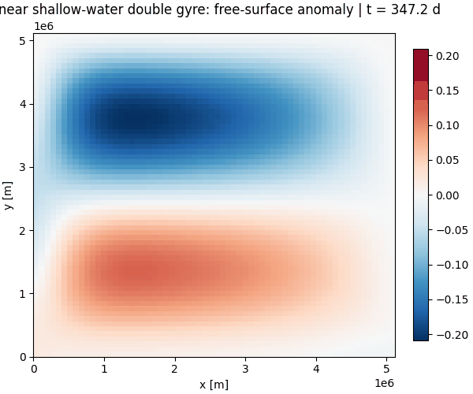
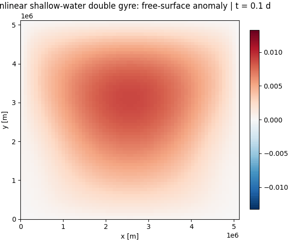

# Double-Gyre Example Scripts

The repository ships three example scripts that use the `finitevolx` API for
spatial operators and `finitevolx.heun_step` for time integration.  Each script
uses `xarray` for preprocessing and postprocessing, writes sampled fields to
Zarr, and saves an animated GIF showing the field evolution over time.

## Running the examples

Install the repository with the example dependencies:

```bash
uv sync --all-extras
```

Then run any example directly:

```bash
uv run python scripts/swm_linear.py
uv run python scripts/shallow_water.py
uv run python scripts/qg_1p5_layer.py
```

Each script writes two artifacts by default:

- a `*.zarr` directory with sampled model fields and diagnostics
- a `*.gif` animated figure showing the field evolution over time

Use `--output-dir` to choose a different location for the artifacts.

## Linear shallow-water model

Script: `scripts/swm_linear.py`

- Periodic beta-plane, double-gyre wind forcing
- Linearised momentum and mass equations
- `xarray` coordinates for the initial height anomaly, Coriolis field, and wind forcing
- Zarr output fields: `eta`, `u`, `v`, `speed`, `relative_vorticity`, `kinetic_energy`, `mass_anomaly`



## Nonlinear shallow-water model

Script: `scripts/shallow_water.py`

- Periodic beta-plane, double-gyre wind forcing
- Nonlinear continuity equation with total depth `H + eta`
- Compact Bernoulli and advective closure in the momentum equation
- Zarr output fields: `eta`, `u`, `v`, `speed`, `relative_vorticity`, `kinetic_energy`, `minimum_depth`



## 1.5-layer QG model

Script: `scripts/qg_1p5_layer.py`

- Closed-basin Atlantic-style double-gyre (no-normal-flow solid walls, ψ = 0)
- Potential-vorticity advection with `Advection2D`
- Streamfunction inversion through `solve_helmholtz_dst` (homogeneous Dirichlet BCs)
- Basin-scale defaults tuned toward the MQGeometry double-gyre benchmark (`Lx = Ly = 5120 km`, `f0 = 9.375e-5 s^-1`, `beta = 1.754e-11 m^-1 s^-1`)
- Saved figure shows **relative vorticity** rather than streamfunction so the eddy field matches the expected diagnostic
- Zarr output fields: `q`, `psi`, `u`, `v`, `speed`, `relative_vorticity`, `pv_enstrophy`


## Stability checks

The repository test suite installs the script dependencies through the `test`
extra and runs smoke tests that execute all three scripts on small grids,
reopen the generated Zarr stores, and check that the saved fields remain finite
and within expected ranges. These automated checks complement the longer manual
runs used to generate the figures shown above.
