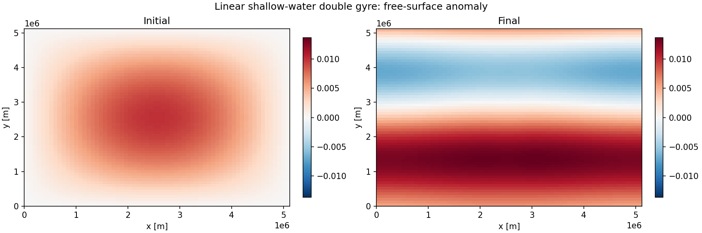
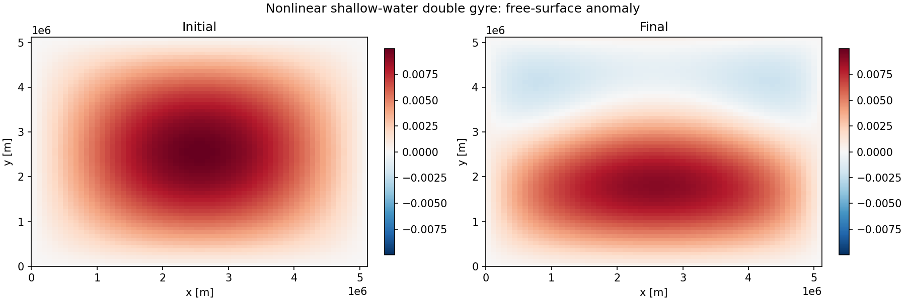
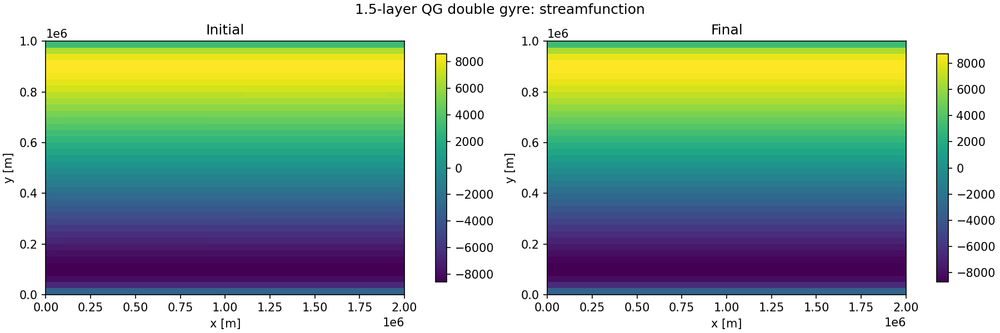

# Double-Gyre Example Scripts

The repository now ships three example scripts that all use the current
`finitevolx` API, use `xarray` for preprocessing and postprocessing, write
sampled fields to Zarr, and save a static before/after comparison figure.
None of the examples open a free-running interactive plot.

## Running the examples

Install the repository with the example dependencies:

```bash
uv sync --all-extras
```

Then run any example directly:

```bash
uv run python scripts/swm_linear.py
uv run python scripts/shallow_water.py
uv run python scripts/qg_1p5_layer.py
```

Each script writes two artifacts by default:

- a `*.zarr` directory with sampled model fields and diagnostics
- a `*.png` comparison figure showing the initial and final state

Use `--output-dir` to choose a different location for the artifacts.

## Linear shallow-water model

Script: `scripts/swm_linear.py`

- Periodic beta-plane, double-gyre wind forcing
- Linearised momentum and mass equations
- `xarray` coordinates for the initial height anomaly, Coriolis field, and wind forcing
- Zarr output fields: `eta`, `u`, `v`, `speed`, `kinetic_energy`, `mass_anomaly`



## Nonlinear shallow-water model

Script: `scripts/shallow_water.py`

- Periodic beta-plane, double-gyre wind forcing
- Nonlinear continuity equation with total depth `H + eta`
- Compact Bernoulli and advective closure in the momentum equation
- Zarr output fields: `eta`, `u`, `v`, `speed`, `kinetic_energy`, `minimum_depth`



## 1.5-layer QG model

Script: `scripts/qg_1p5_layer.py`

- Periodic beta-plane, double-gyre wind-curl forcing
- Potential-vorticity advection with `Advection2D`
- Streamfunction inversion through `solve_helmholtz_fft`
- Zarr output fields: `q`, `psi`, `u`, `v`, `speed`, `pv_enstrophy`



## Stability checks

The repository test suite includes smoke tests that run all three scripts on small
grids, reopen the generated Zarr stores, and check that the saved fields remain
finite and within expected ranges. These tests complement the longer manual runs
used to generate the figures shown above.
