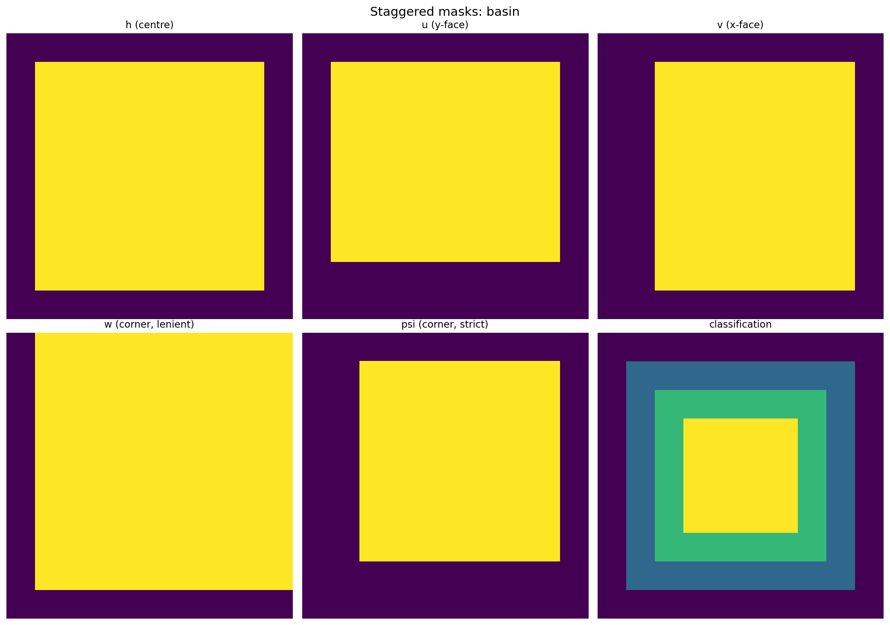
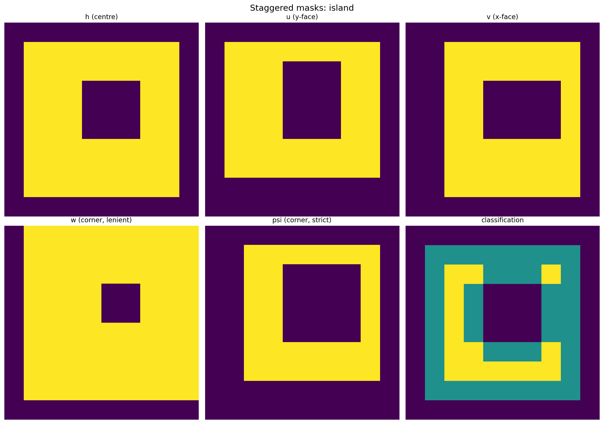
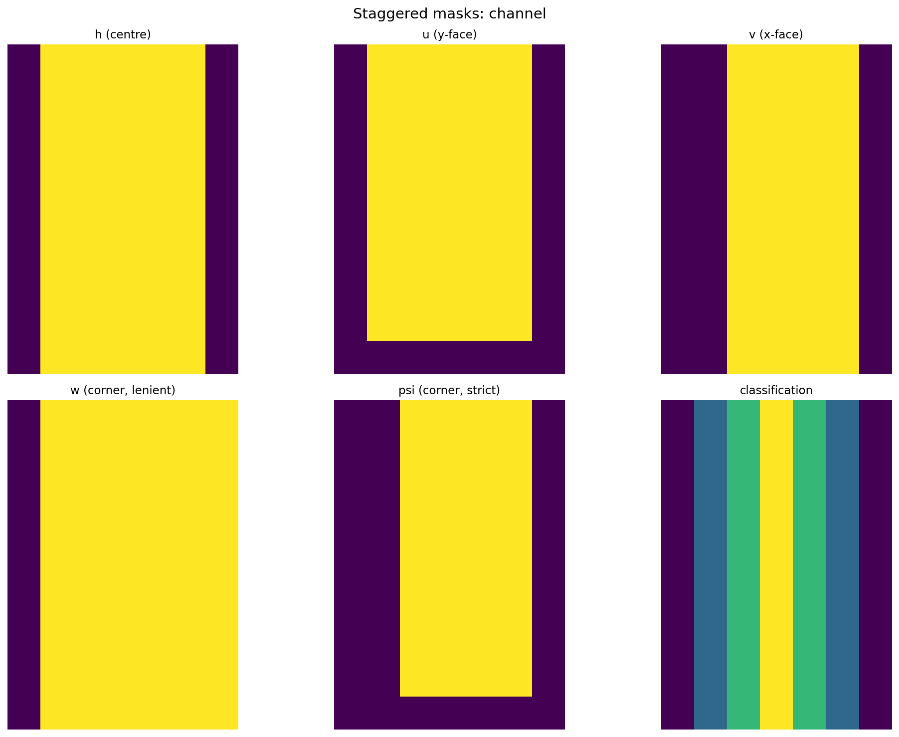
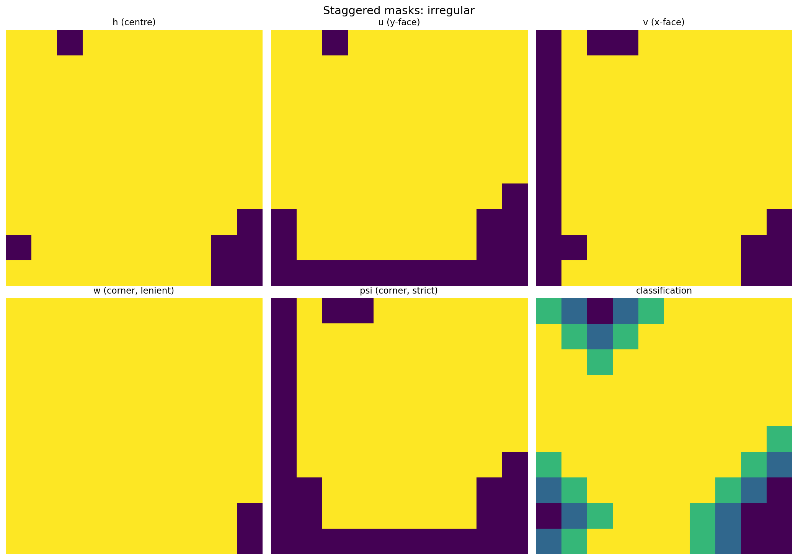
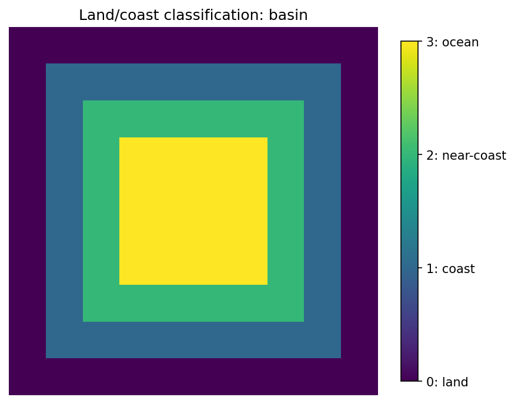
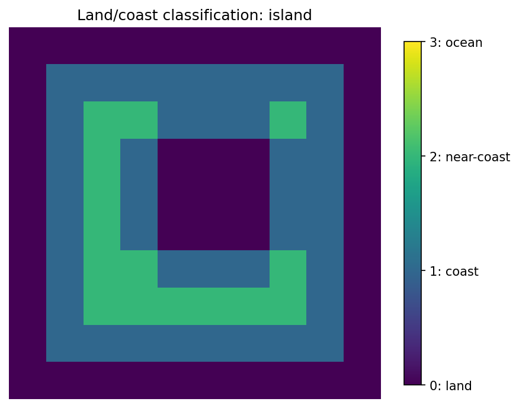
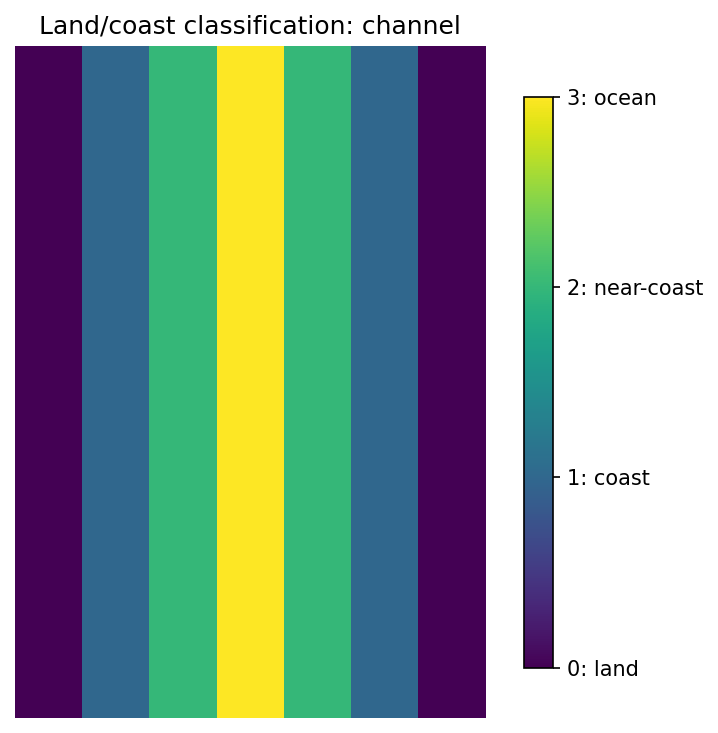
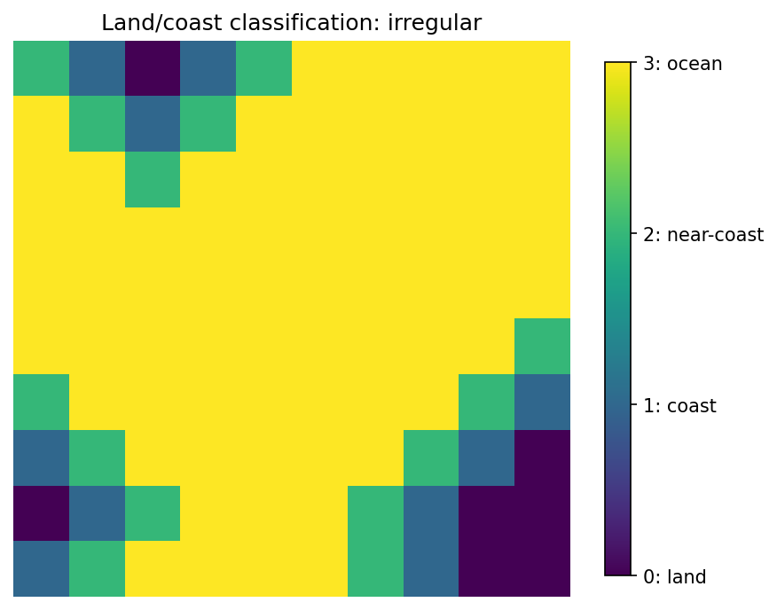

# Arakawa C-Grid Masks

`Mask2D` builds all staggered masks from a single cell-centre
wet/dry field, following the Arakawa & Lamb (1977) grid layout:

```
y
^
:           :
w-----v-----w..
|           |
|           |
u     h     u
|           |
|           |
w-----v-----w..   > x
```

| Point                | Location                  | Variable                         |
|----------------------|---------------------------|----------------------------------|
| **h**                | cell centre               | tracers, height, pressure        |
| **u**                | y-face (east/west)        | zonal velocity                   |
| **v**                | x-face (north/south)      | meridional velocity              |
| **xy_corner**        | SW corner (lenient)       | vorticity                        |
| **xy_corner_strict** | SW corner (strict)        | streamfunction                   |

## Creating masks

All you need is a binary h-grid mask (True = ocean, False = land).
The factory method derives everything else:

```python
import numpy as np
from finitevolx import Mask2D

# Rectangular basin with land boundaries
n = 10
h_mask = np.ones((n, n), dtype=bool)
h_mask[0, :] = h_mask[-1, :] = False
h_mask[:, 0] = h_mask[:, -1] = False

# With an island
h_mask[4:7, 4:7] = False

masks = Mask2D.from_mask(h_mask)
```

For an all-ocean domain, use the shortcut:

```python
masks = Mask2D.from_dimensions(ny=12, nx=12)
```

Or construct from an SSH field where NaN marks land:

```python
masks = Mask2D.from_ssh(ssh_field)
```

## Staggered variable locations

Each variable type sits at a different position within a grid cell.
The figures below show the actual staggered positions for several
domain topologies:

### Rectangular basin



### Basin with island



### Zonal channel



### Irregular coastline



## Land / coast classification

The mask includes a 4-level classification (0 = land, 1 = coast,
2 = near-coast, 3 = open ocean):

### Rectangular basin



### Basin with island



### Zonal channel



### Irregular coastline



## Vorticity boundary classification

At xy-corner points, cells are classified based on their relationship
to adjacent velocity faces:

- **xy_corner_valid** — interior: all 4 adjacent velocity faces are wet
- **xy_corner_y_wall** — on a vertical (y-direction) boundary
- **xy_corner_x_wall** — on a horizontal (x-direction) boundary
- **xy_corner_convex** — at convex corners (both boundary types)

## Stencil capability and adaptive WENO

Each cell stores how many contiguous wet neighbours it has in each
direction via `StencilCapability2D`. This drives adaptive stencil
selection for WENO reconstruction near coastlines:

```python
# Mutually-exclusive masks: largest usable stencil at each point
adaptive = masks.get_adaptive_masks(direction="x", source="h")
# adaptive[2]  → 1st-order upwind only
# adaptive[4]  → WENO3
# adaptive[6]  → WENO5
# adaptive[8]  → WENO7
# adaptive[10] → WENO9
```

## Jupyter notebook

A complete interactive demo is available as a jupytext notebook:
[`notebooks/demo_masks.py`](https://github.com/jejjohnson/finitevolX/blob/main/notebooks/demo_masks.py)
