# Solver Comparison

This page provides a visual comparison of finitevolX's elliptic solver
families across different domain geometries.  All benchmarks use a
64x64 grid with Helmholtz parameter $\lambda = 4$ and a smooth sinusoidal
RHS.

Each solver panel shows three fields: the **RHS** $f$, the computed
**solution** $\hat{u}$, and the **error** $f - A\hat{u}$ (the pointwise
residual).

!!! note "Reproducing these figures"
    These figures are generated by the [Elliptic Solvers notebook](../notebooks/demo_solvers.py).

---

## Domain Geometries

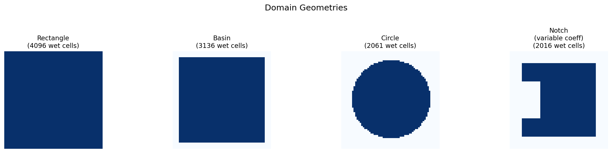

| Domain | Description | Coefficient |
|---|---|---|
| **Rectangle** | Full 64x64 grid, no mask | Constant |
| **Basin** | 4-cell land border on all sides | Constant |
| **Circle** | Circular ocean basin (radius = 0.4N) | Constant |
| **Notch** | Rectangle with thick walls and a left notch | Variable $c(x,y) = 1 + 0.8\sin(2\pi x/L)$ |

---

## Rectangle

The simplest geometry — all solvers applicable.

### Spectral (DST)

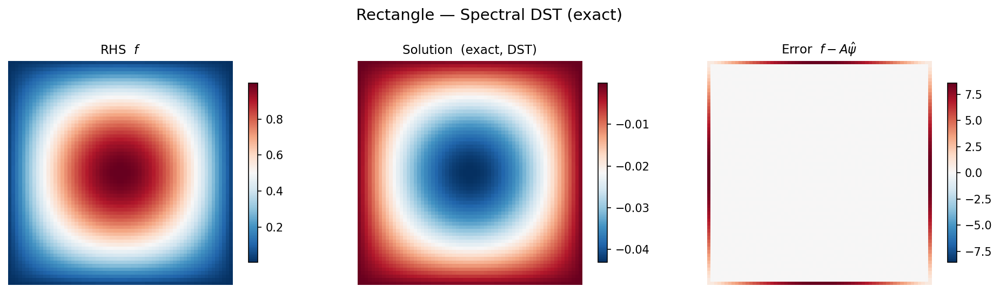

### CG + spectral preconditioner

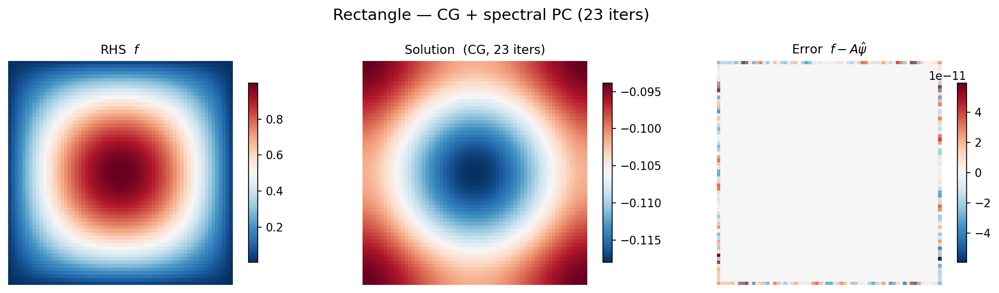

### Multigrid (8 V-cycles)

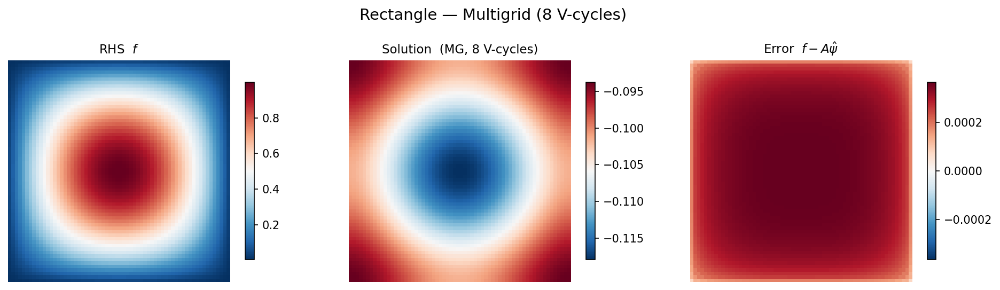

---

## Basin (land border)

A rectangular ocean basin with a 4-cell land border.  The capacitance
method extends the spectral solver to handle the mask.

### Capacitance matrix (direct)

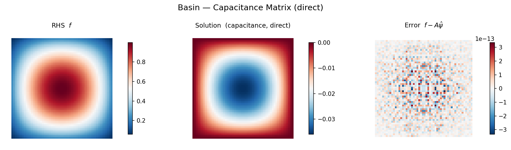

### CG + spectral preconditioner

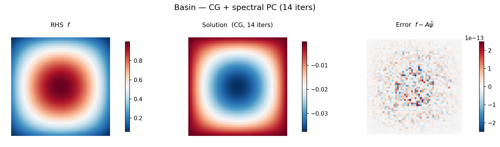

### Multigrid (8 V-cycles)

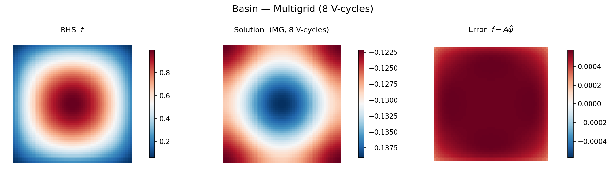

---

## Circle

A circular ocean basin — too many boundary points for efficient
capacitance, so we use iterative solvers.

### CG + spectral preconditioner

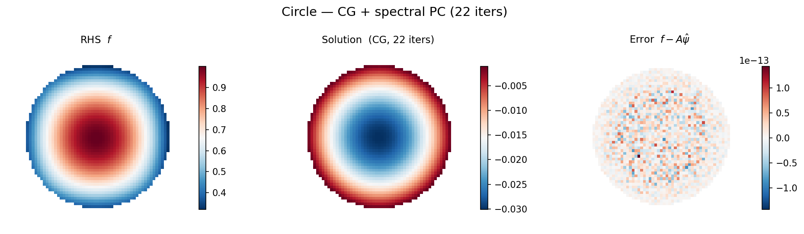

### Multigrid (8 V-cycles)

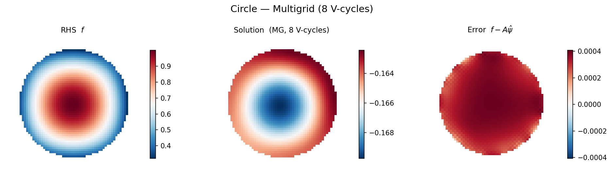

---

## Notch (variable coefficient)

The hardest case: spatially varying $c(x,y)$ on a masked domain.
Only multigrid handles variable coefficients natively.

### Multigrid standalone (10 V-cycles)

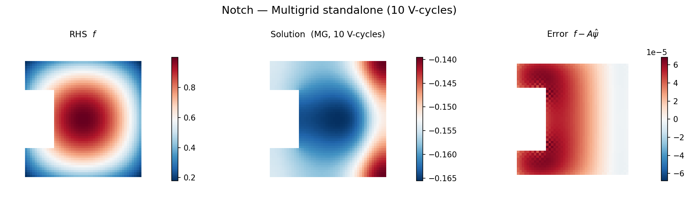

### MG-preconditioned CG

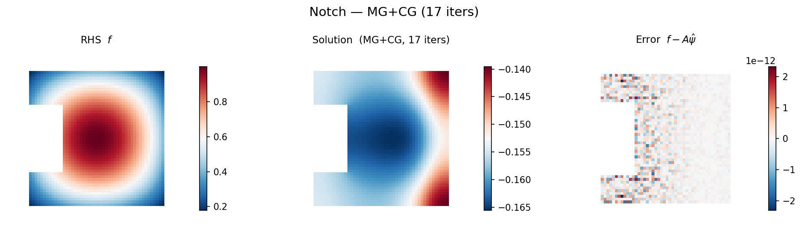

---

## Accuracy and Timing

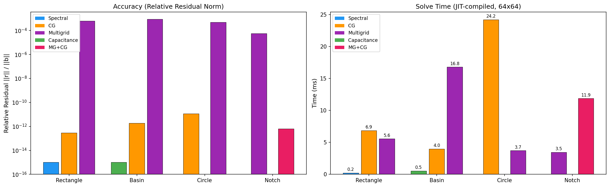

**Left panel — Accuracy.**  Relative residual $\|b - Au\| / \|b\|$ measured
on wet interior cells.  Direct solvers (Spectral, Capacitance) are exact
by construction.  CG converges to the specified tolerance ($10^{-10}$ to
$10^{-12}$).  Multigrid standalone reaches $\sim 10^{-4}$ with 8–10
V-cycles — sufficient for most applications and refinable by adding more
cycles or wrapping in CG.

**Right panel — Timing.**  JIT-compiled wall-clock time on a 64x64 grid
(median of 5 runs after warmup).  Spectral and Capacitance are sub-millisecond.
Multigrid is 3–5 ms.  CG takes 4–10 ms depending on iteration count.

---

## Solver Summary

| Solver | Type | Constant coeff | Variable coeff | Masked domain | Speed | Accuracy |
|---|---|---|---|---|---|---|
| **Spectral** | Direct | Exact | No | No | Fastest ($O(N \log N)$) | Machine precision |
| **Capacitance** | Direct | Exact | No | Yes (simple) | Very fast | Machine precision |
| **CG** | Iterative | Yes | With preconditioner | Yes | Moderate | Controllable (tolerance) |
| **Multigrid** | Iterative | Yes | Yes (native) | Yes (native) | Fast ($O(N)$ per cycle) | $\sim 10^{-4}$ per 8 cycles |
| **MG + CG** | Iterative | Yes | Yes (native) | Yes (native) | Moderate | Controllable (tolerance) |

---

## When to Use What

```
Is c(x,y) spatially varying?
├── Yes → Multigrid standalone (fast)
│         or MG-preconditioned CG (tightest tolerance)
└── No (constant coefficient) ↓

Is the domain a full rectangle?
├── Yes → Spectral solver (fastest, exact)
└── No (masked/irregular) ↓

Is the coastline simple (small number of boundary points)?
├── Yes → Capacitance matrix (near-spectral speed, exact)
└── No (complex coastline) ↓

Need tight tolerance control?
├── Yes → CG + spectral preconditioner
│         (or CG + multigrid preconditioner for complex masks)
└── No (moderate accuracy OK) → Multigrid standalone
```

### Detailed Recommendations

**Spectral** (`solve_helmholtz_dst`, `solve_helmholtz_dct`, `solve_helmholtz_fft`)

- The gold standard for rectangular, constant-coefficient problems
- Sub-millisecond, exact to machine precision
- Choose DST (Dirichlet), DCT (Neumann), or FFT (periodic) based on BCs

**Capacitance** (`build_capacitance_solver`)

- Extends spectral solvers to masked domains
- Offline precomputation cost scales with the number of boundary points $N_b$
- Online solve is essentially one spectral solve + $O(N_b^2)$ correction
- Best when $N_b$ is small (simple coastlines)

**CG** (`solve_cg`)

- Most flexible: works with any symmetric operator
- Convergence controlled by `rtol`/`atol` — get exactly the accuracy you need
- Pair with a preconditioner for practical convergence rates:
    - **Spectral preconditioner**: free, good for near-rectangular constant-coeff
    - **Multigrid preconditioner**: handles variable coefficients and complex masks
    - See the [Preconditioner Guide](elliptic_solvers.md#preconditioners) for details

**Multigrid** (`build_multigrid_solver`)

- The only solver that handles variable $c(x,y)$ natively
- $O(N)$ per V-cycle — optimal complexity
- 8–10 V-cycles typically give $10^{-4}$ to $10^{-5}$ relative residual
- For tighter tolerance, wrap as a CG preconditioner (MG+CG)
- Three autodiff modes: implicit, one-step, unrolled
  (see [Multigrid Theory](multigrid_solver.md#differentiating-through-the-solve))

---

## References

- [Elliptic Solvers — Theory](elliptic_solvers.md): spectral theory, capacitance
  method, preconditioner comparison
- [Elliptic Solvers — Usage](elliptic_solvers_usage.md): code examples for all
  solvers
- [Multigrid Solver — Theory](multigrid_solver.md): V-cycle algorithm, variable
  coefficients, differentiation strategies
- [Multigrid Solver — Usage](multigrid_solver_usage.md): building, solving,
  tuning
